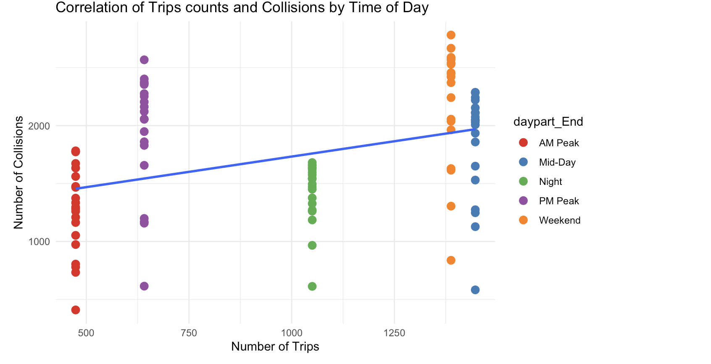

# info201-final-project
info201 ac-6 final project
In this project, we analyzed the relationship between peak vehicle travel time periods and high vehicle crash time periods. By filtering for specific vehicle types and randomly selecting samples, we constructed a dataset that could be used for analysis. Our methodology included grouping the collision data by year and time of day and then merging it with the shared trip data.
Graphs show the relationship between the number of trips and the number of collisions at different times of the day. The results show that the number of collisions increases as the number of trips increases during the AM and PM peak hours.
Seattle's bustling urban landscape is a dynamic backdrop for exploring the intersection of urban mobility and traffic safety. In recent years, shared mobility services have revolutionized urban transportation, providing convenient, environmentally friendly alternatives to traditional vehicle travel. However, the integration of these services into the urban fabric raises critical questions about transportation dynamics and safety. 
This analysis delves into the heart of this modern conundrum, analyzing how people travel in Seattle and how crashes occur over the course of a year, revealing patterns and insights that can inform policy, urban planning, and the future of sustainable urban mobility.

